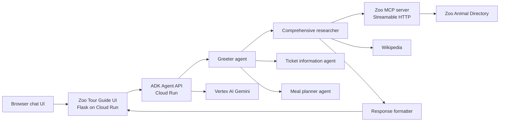

# Zoo Tour Guide

A multi-agent Zoo Tour Guide deployed on Google Cloud Run. It answers questions about animals at the zoo, combines internal Zoo Animal Directory records with Wikipedia research, and presents a friendly response through a browser chat application.

## Live Services

| Service | Region | URL | Purpose |
| --- | --- | --- | --- |
| Zoo Tour Guide UI | Configured deployment region | Obtain with `gcloud run services describe` | Browser chat interface |
| ADK agent API | Configured deployment region | Obtain with `gcloud run services describe` | Agent runtime and REST API |
| Zoo MCP server | Configured deployment region | Obtain with `gcloud run services describe` | Internal zoo data tools |

## Architecture



If Mermaid diagrams are not rendered in your Markdown viewer, the same flow is:

```text
Browser chat UI
  |
  v
Zoo Tour Guide UI (Flask, Cloud Run)
  |
  v
ADK Agent API (Cloud Run) ---> Vertex AI Gemini
  |
  v
Greeter agent ---> Comprehensive researcher ---> Response formatter
      |              |             |
      |              |             +--> Wikipedia
      |              v
      |       Zoo MCP server (Streamable HTTP)
      |              |
      |              v
      |       Zoo Animal Directory
      v
Ticket information agent
      |
      v
    Meal planner agent
```

## Agent Workflow

The root `greeter` agent routes animal research, Zoo admission, and Zoo Cafe meal requests to the appropriate specialist.

`tour_guide_workflow` is a `SequentialAgent` containing:

1. `comprehensive_researcher`: retrieves animals, ages, and exhibit locations from the Zoo MCP server. For questions asking about habitat, diet, lifespan, or general facts, it also queries Wikipedia. Zoo questions are instructed to call `find_animals` first.
2. `response_formatter`: converts the collected data into a friendly visitor response, presenting zoo-specific details first.

Sibling specialists of `tour_guide_workflow` are:

1. `ticket_information_agent`: retrieves the current sample Zoo rates for day, night, half-day, half-night, weekly, monthly, yearly, individual, family, resident, and non-resident passes.
2. `meal_planner_agent`: recommends dietary-aware Zoo Cafe selections, calculates order prices and calories, and applies the $20 food credit included with an eligible full-day pass.

Zoo Cafe prices, calorie counts, and food-credit rules are sample data for this demonstration. Replace them with an approved cafe catalog before production use.

## Models and Tools

| Component | Implementation |
| --- | --- |
| LLM | Vertex AI `gemini-2.5-flash` |
| Agent framework | Google Agent Development Kit (ADK) |
| Internal data connection | Model Context Protocol (MCP), Streamable HTTP |
| MCP client | `MCPToolset` and `StreamableHTTPConnectionParams` |
| Zoo tools | `find_animals(query)`, `list_animals()` |
| General knowledge tool | LangChain `WikipediaQueryRun` |
| Chat UI | Flask, vanilla HTML/CSS/JavaScript |
| Hosting | Google Cloud Run source deployment |
| Logging | Google Cloud Logging |

The sample Zoo Animal Directory contains Asha (Asian elephant), Milo (African elephant), Nala (African lion), and Kiko (Red panda).

## Project Layout

```text
.
├── multi_tool_agent/       # ADK agent package
│   ├── agent.py
│   └── .env
├── zoo_mcp_server/         # Zoo directory MCP service
│   ├── server.py
│   ├── requirements.txt
│   └── Procfile
├── zoo_chat_ui/            # Browser chat service
│   ├── app.py
│   ├── templates/index.html
│   ├── requirements.txt
│   └── Procfile
└── requirements.txt         # ADK agent dependencies
```

## Prerequisites

- Google Cloud project with billing enabled
- Google Cloud CLI authenticated with `gcloud auth login`
- Vertex AI API enabled
- Cloud Run, Cloud Build, Artifact Registry, and Cloud Logging APIs enabled as prompted by `gcloud run deploy`

Set your active project:

```bash
gcloud config set project PROJECT_ID
```

For source deployments using the default Compute Engine service account, grant it the roles used by builds and Gemini requests:

```bash
PROJECT_NUMBER="$(gcloud projects describe PROJECT_ID --format='value(projectNumber)')"
SERVICE_ACCOUNT="${PROJECT_NUMBER}-compute@developer.gserviceaccount.com"

gcloud projects add-iam-policy-binding PROJECT_ID \
  --member="serviceAccount:${SERVICE_ACCOUNT}" \
  --role="roles/run.builder"

gcloud projects add-iam-policy-binding PROJECT_ID \
  --member="serviceAccount:${SERVICE_ACCOUNT}" \
  --role="roles/aiplatform.user"
```

For production, use dedicated build and runtime service accounts with least-privilege roles instead of the default Compute Engine account.

## Configuration

Create `multi_tool_agent/.env` for local ADK development:

```env
GOOGLE_GENAI_USE_VERTEXAI=TRUE
GOOGLE_CLOUD_PROJECT=PROJECT_ID
GOOGLE_CLOUD_LOCATION=us-central1
MODEL=gemini-2.5-flash
MCP_SERVER_URL=https://zoo-mcp-server-PROJECT_NUMBER.us-west1.run.app/mcp
MCP_SERVER_AUTHENTICATED=FALSE
```

`MCP_SERVER_AUTHENTICATED=FALSE` is correct for a public Zoo MCP server. For a protected Cloud Run MCP service, set it to `TRUE`; the agent obtains and sends a Google identity token.

Cloud Run does not upload nested `.env` files by default. Pass these values with `--set-env-vars` during deployment.

## Deploy

Set shell variables before deploying:

```bash
PROJECT_ID="YOUR_PROJECT_ID"
PROJECT_NUMBER="$(gcloud projects describe "$PROJECT_ID" --format='value(projectNumber)')"
AGENT_REGION="us-central1"
MCP_REGION="us-west1"
MCP_URL="https://zoo-mcp-server-${PROJECT_NUMBER}.${MCP_REGION}.run.app/mcp"
```

### 1. Deploy the Zoo MCP Server

```bash
gcloud run deploy zoo-mcp-server \
  --source zoo_mcp_server \
  --project "$PROJECT_ID" \
  --region "$MCP_REGION" \
  --allow-unauthenticated
```

### 2. Deploy the ADK Agent API

```bash
gcloud run deploy weather-agent \
  --source . \
  --project "$PROJECT_ID" \
  --region "$AGENT_REGION" \
  --allow-unauthenticated \
  --set-env-vars "GOOGLE_GENAI_USE_VERTEXAI=TRUE,GOOGLE_CLOUD_PROJECT=${PROJECT_ID},GOOGLE_CLOUD_LOCATION=${AGENT_REGION},MODEL=gemini-2.5-flash,MCP_SERVER_URL=${MCP_URL},MCP_SERVER_AUTHENTICATED=FALSE"
```

Capture its URL:

```bash
AGENT_URL="$(gcloud run services describe weather-agent --project "$PROJECT_ID" --region "$AGENT_REGION" --format='value(status.url)')"
```

### 3. Deploy the Browser Chat UI

```bash
gcloud run deploy zoo-tour-guide-ui \
  --source zoo_chat_ui \
  --project "$PROJECT_ID" \
  --region "$AGENT_REGION" \
  --allow-unauthenticated \
  --set-env-vars "AGENT_URL=${AGENT_URL}"
```

Open the displayed UI URL in a browser.

## Test the Deployment

### Browser

Open the Zoo Tour Guide UI and ask:

```text
Tell me about the elephants at our zoo and their natural habitat.
```

The answer should identify Asha and Milo with their age and exhibit location, then provide habitat information.

Ask about ticket options:

```text
What are the options and eligibility rules for a resident family yearly pass?
```

Ask for a calorie-aware Zoo Cafe meal plan:

```text
Plan a vegetarian meal below 1000 calories: a garden salad, paneer tikka, fruit bowl, and diet soda. I have a full day pass with food included.
```

The Meal Planner should calculate the calorie total and order subtotal, then apply the $20 full-day-pass food credit when eligible.

### Agent REST API

List deployed ADK applications:

```bash
curl -sS "$AGENT_URL/list-apps"
```

Create a fresh session and send a query:

```bash
SESSION_ID="zoo_test_$(date +%s)"

curl -sS -X POST \
  "$AGENT_URL/apps/multi_tool_agent/users/test_user/sessions/$SESSION_ID" \
  -H "Content-Type: application/json" \
  -d '{}'

curl -sS -X POST "$AGENT_URL/run" \
  -H "Content-Type: application/json" \
  -d "{\"appName\":\"multi_tool_agent\",\"userId\":\"test_user\",\"sessionId\":\"$SESSION_ID\",\"newMessage\":{\"role\":\"user\",\"parts\":[{\"text\":\"Tell me about the elephants at our zoo and their natural habitat.\"}]}}"
```

The ADK API documentation is available at `$AGENT_URL/docs`.

### MCP Server Directly

Initialize an MCP session, retaining the `mcp-session-id` response header:

```bash
curl -i -sS -X POST "$MCP_URL" \
  -H "Content-Type: application/json" \
  -H "Accept: application/json, text/event-stream" \
  -H "MCP-Protocol-Version: 2025-03-26" \
  -d '{"jsonrpc":"2.0","id":1,"method":"initialize","params":{"protocolVersion":"2025-03-26","capabilities":{},"clientInfo":{"name":"test-client","version":"1.0"}}}'
```

Then call `find_animals`, replacing `SESSION_ID`:

```bash
curl -sS -X POST "$MCP_URL" \
  -H "Content-Type: application/json" \
  -H "Accept: application/json, text/event-stream" \
  -H "MCP-Protocol-Version: 2025-03-26" \
  -H "mcp-session-id: SESSION_ID" \
  -d '{"jsonrpc":"2.0","id":2,"method":"tools/call","params":{"name":"find_animals","arguments":{"query":"elephant"}}}'
```

## Security Notes

The current services allow unauthenticated access for demonstration purposes. Before production use, restrict Cloud Run invoker access and place an authentication layer in front of the UI and agent API. Do not commit credentials or real secrets to `.env` files.
