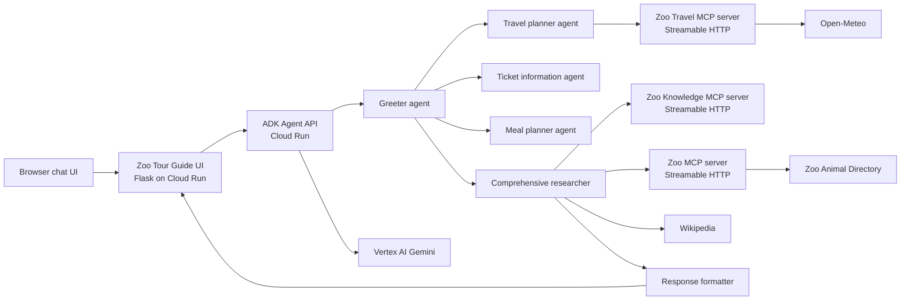

# Zoo Tour Guide

A multi-agent Zoo Tour Guide deployed on Google Cloud Run. It answers questions about animals at the zoo, combines internal Zoo Animal Directory records with Wikipedia research, and presents a friendly response through a browser chat application.

## Live Services

| Service | Region | URL | Purpose |
| --- | --- | --- | --- |
| Zoo Tour Guide UI | Configured deployment region | Obtain with `gcloud run services describe` | Browser chat interface |
| ADK agent API | Configured deployment region | Obtain with `gcloud run services describe` | Agent runtime and REST API |
| Zoo MCP server | Configured deployment region | Obtain with `gcloud run services describe` | Internal zoo data tools |
| Zoo Travel MCP server | Configured deployment region | Obtain with `gcloud run services describe` | Internal location, weather, forecast, and route tools |
| Zoo Knowledge MCP server | Configured deployment region | Obtain with `gcloud run services describe` | Internal curated Zoo knowledge retrieval |

## Architecture



If Mermaid diagrams are not rendered in your Markdown viewer, the same flow is:

```text
Browser chat UI
  |
  v
Zoo Tour Guide UI (Flask, Cloud Run)
  |
  v
ADK Agent API (Cloud Run) ---> Vertex AI Gemini
  |
  v
Greeter agent ---> Comprehensive researcher ---> Response formatter
      |              |             |
      |              |             +--> Wikipedia
      |              v
      |       Zoo MCP server (Streamable HTTP)
      |              |
      |              v
      |       Zoo Animal Directory
      v
Ticket information agent
      |
      v
    Meal planner agent
      |
      v
    Travel planner agent ---> Zoo Travel MCP server (Streamable HTTP) ---> Open-Meteo
```

## Agent Workflow

The root `greeter` agent routes animal research, Zoo admission, and Zoo Cafe meal requests to the appropriate specialist.

`tour_guide_workflow` is a `SequentialAgent` containing:

1. `comprehensive_researcher`: retrieves animals, ages, and exhibit locations from the Zoo MCP server. For questions asking about habitat, diet, lifespan, or general facts, it retrieves approved Zoo knowledge with source attribution before using Wikipedia as a fallback. Zoo questions are instructed to call `find_animals` first.
2. `response_formatter`: converts the collected data into a friendly visitor response, presenting zoo-specific details first.

Sibling specialists of `tour_guide_workflow` are:

1. `ticket_information_agent`: retrieves the current sample Zoo rates for day, night, half-day, half-night, weekly, monthly, yearly, individual, family, resident, and non-resident passes.
2. `meal_planner_agent`: recommends dietary-aware Zoo Cafe selections, calculates order prices and calories, and applies the $20 food credit included with an eligible full-day pass.
3. `travel_planner_agent`: helps visitors choose one of four demonstration Zoo locations, retrieves weather and forecasts, provides configured location details, and calculates traffic-free driving distance and estimated duration after it receives an origin. For a nearest-Zoo question, it can use a visitor's consented browser location to make one traffic-free route comparison.

Zoo Cafe prices, calorie counts, and food-credit rules are sample data for this demonstration. Replace them with an approved cafe catalog before production use.

## Models and Tools

| Component | Implementation |
| --- | --- |
| LLM | Vertex AI `gemini-2.5-flash` |
| Agent framework | Google Agent Development Kit (ADK) |
| Internal data connection | Model Context Protocol (MCP), Streamable HTTP |
| MCP client | `MCPToolset` and `StreamableHTTPConnectionParams` |
| Zoo tools | `find_animals(query, zoo_id)`, `list_animals(zoo_id)`, `get_animal_count(zoo_id)` |
| Curated knowledge tools | `search_curated_knowledge(query, zoo_id, max_results)` |
| Zoo travel tools | `get_server_date()`, `list_zoo_locations()`, `get_zoo_location(zoo_id)`, `get_zoo_weather(zoo_id)`, `get_weather_forecast(zoo_id, visit_date, days)`, `get_route_to_zoo(origin, zoo_id)`, `find_nearest_zoo(origin_latitude, origin_longitude)` |
| General knowledge tool | LangChain `WikipediaQueryRun` |
| Chat UI | Flask, vanilla HTML/CSS/JavaScript |
| Hosting | Google Cloud Run source deployment |
| Logging | Google Cloud Logging |

The Zoo Animal Directory contains 400 approved demonstration records: 100 for
each of Chicago, San Diego, Bronx, and Washington, DC. Each location has five
exclusive species. Asha (Asian elephant), Milo (African elephant), Nala (African
lion), and Kiko (Red panda) are Chicago demonstration records. Animal queries
require a Zoo ID confirmed by the Travel MCP service.

### Animal Catalog Configuration

Zoo Directory uses the validated in-memory demonstration catalog by default. Set
`CATALOG_DATABASE_URL` to use PostgreSQL for directory reads. Store the value in
Secret Manager and make the database privately reachable from the Zoo MCP service.
Load the initial catalog or approved catalog changes with:

```bash
python -m zoo_mcp_server.ingest
```

The command validates record IDs, approval status, 100-animal Zoo counts, and
exclusive species before upserting records. It must run as a controlled maintenance
job, never during a visitor request. The Zoo Directory and Travel MCP services must
use the same canonical Zoo IDs: `chicago`, `san_diego`, `bronx`, and
`washington_dc`.

## Project Layout

```text
.
├── multi_tool_agent/       # ADK agent package
│   ├── agent.py
│   └── .env
├── zoo_mcp_server/         # Zoo directory MCP service
│   ├── server.py
│   ├── requirements.txt
│   └── Procfile
├── zoo_travel_mcp_server/  # Zoo travel conditions MCP service
│   ├── server.py
│   ├── requirements.txt
│   └── Procfile
├── zoo_knowledge_mcp_server/ # Curated Zoo knowledge MCP service
│   ├── documents/
│   ├── server.py
│   ├── requirements.txt
│   └── Procfile
├── zoo_chat_ui/            # Browser chat service
│   ├── app.py
│   ├── templates/index.html
│   ├── requirements.txt
│   └── Procfile
└── requirements.txt         # ADK agent dependencies
```

## Roadmap

The planned delivery sequence is in [ROADMAP.md](ROADMAP.md). The current focus
is evaluation and observability before adding managed Zoo data or retrieval.

## Prerequisites

- Google Cloud project with billing enabled
- Google Cloud CLI authenticated with `gcloud auth login`
- Vertex AI API enabled
- Cloud Run, Cloud Build, Artifact Registry, and Cloud Logging APIs enabled as prompted by `gcloud run deploy`

Set your active project:

```bash
gcloud config set project PROJECT_ID
```

For source deployments using the default Compute Engine service account, grant it the roles used by builds and Gemini requests:

```bash
PROJECT_NUMBER="$(gcloud projects describe PROJECT_ID --format='value(projectNumber)')"
SERVICE_ACCOUNT="${PROJECT_NUMBER}-compute@developer.gserviceaccount.com"

gcloud projects add-iam-policy-binding PROJECT_ID \
  --member="serviceAccount:${SERVICE_ACCOUNT}" \
  --role="roles/run.builder"

gcloud projects add-iam-policy-binding PROJECT_ID \
  --member="serviceAccount:${SERVICE_ACCOUNT}" \
  --role="roles/aiplatform.user"
```

For production, use dedicated build and runtime service accounts with least-privilege roles instead of the default Compute Engine account.

## Configuration

Create `multi_tool_agent/.env` for local ADK development:

```env
GOOGLE_GENAI_USE_VERTEXAI=TRUE
GOOGLE_CLOUD_PROJECT=PROJECT_ID
GOOGLE_CLOUD_LOCATION=us-central1
MODEL=gemini-2.5-flash
MCP_SERVER_URL=https://zoo-mcp-server-PROJECT_NUMBER.us-west1.run.app/mcp
TRAVEL_MCP_SERVER_URL=https://zoo-travel-mcp-server-PROJECT_NUMBER.us-west1.run.app/mcp
KNOWLEDGE_MCP_SERVER_URL=https://zoo-knowledge-mcp-server-PROJECT_NUMBER.us-west1.run.app/mcp
MCP_SERVER_AUTHENTICATED=FALSE
UPSTREAM_TIMEOUT_SECONDS=10
NOMINATIM_USER_AGENT=zoo-tour-guide-demo/1.0 (contact: YOUR_CONTACT_EMAIL)
CACHE_REDIS_URL=redis://REDIS_HOST:6379/0
CACHE_KEY_PREFIX=zoo-tour-guide:v1
TRAVEL_CACHE_MAX_ENTRIES=200
```

Use `MCP_SERVER_AUTHENTICATED=TRUE` for a protected Cloud Run MCP service; the agent obtains and sends a Google identity token. The browser UI also obtains an identity token before calling the private ADK agent API.

The travel MCP server uses Open-Meteo for weather and forecasts, Nominatim for origin geocoding, and OSRM for traffic-free driving distance and duration estimates. These public services require no API key, but Nominatim requests must identify the deployment with `NOMINATIM_USER_AGENT` and must be kept within its usage policy. The default Chicago, San Diego, Bronx, and Washington, DC locations are demonstration data. Replace them with approved locations by setting `ZOO_LOCATIONS_JSON` to a JSON array whose entries provide `id`, `name`, `address`, `latitude`, and `longitude`.

### Hybrid Curated RAG Configuration

The Knowledge MCP service supports an offline BM25 mode by default. Set
`KNOWLEDGE_DATABASE_URL` to enable production hybrid retrieval: PostgreSQL full-text
search plus `pgvector` semantic search, fused with reciprocal rank fusion. The
database must support the `vector` extension and be privately reachable from the
Knowledge MCP Cloud Run service. Store the connection URL in Secret Manager and use
a VPC connector or direct VPC egress appropriate to the Cloud SQL network setup.

The service uses Vertex AI `text-embedding-005` with 768 dimensions by default.
Set `VERTEX_EMBEDDING_MODEL` only when the selected model supports that output
dimension. Set `GEMINI_RERANKER_ENABLED=TRUE` to use Gemini to reorder the already
retrieved approved chunks. It is `FALSE` by default; in either setting, the local
lexical reranker is available and a Gemini error preserves hybrid retrieval order.

Approved Markdown documents require `id`, `title`, `source`, `updated_at`,
`version`, `approval_status: approved`, and `zoo_id`. Use `zoo_id: global` for
guidance shared by all locations. Run ingestion as a controlled job after an
approved document update:

```bash
python -m zoo_knowledge_mcp_server.ingest
```

The command creates the storage schema and skips unchanged document versions before
requesting Vertex embeddings. Curated responses retain document title, source,
version, update date, and Zoo scope. When curated retrieval is empty or insufficient,
the agent may use Wikipedia and must present it as external general research.

Cloud Run does not upload nested `.env` files by default. Pass these values with `--set-env-vars` during deployment.

### Cache Configuration

The UI uses `CACHE_REDIS_URL` when configured to cache an exact repeated, eligible
question for the same authenticated Firebase user and ADK session. A cache hit
returns the saved final answer and sanitized Activity list without invoking the
ADK API or Gemini again. Cached entries expire after 30 minutes. Cache keys contain
only a version prefix, user/session identifiers, and a SHA-256 hash of normalized
question text; cached values contain only the final answer and sanitized agent/tool
names. Firebase tokens, Cloud Run identity tokens, raw ADK events, tool arguments,
tool results, and role state are never cached.

Dynamic and role-dependent requests bypass this answer cache, including weather,
forecasts, routes, opening hours, dates, tickets, passes, Cafe orders, credits, and
discounts. Redis connection, read, and write failures fail open: the UI continues
to call the agent normally. A request marked as using consented device location
also bypasses the answer cache.

### Optional Device Location

The browser requests device location only after the visitor selects **Use location**.
It is optional and requires a secure browser context. The browser keeps the result
only until the next chat request, then clears it. Flask accepts only finite latitude
and longitude JSON numbers within valid geographic ranges, rounds them to three
decimal places, and places that coarse value in the server-created ADK session.
Raw coordinates are not logged, placed in Activity, added to Redis, or sent to
Nominatim. The Travel MCP service compares traffic-free OSRM routes internally and
returns only the nearest configured Zoo; visitors can always provide a typed origin
instead.

For a Cloud Run deployment with more than one UI instance, use a private
Redis-compatible service such as Memorystore and connect it through the service's
VPC connector. Set `CACHE_REDIS_URL` only on the UI service. Bump
`CACHE_KEY_PREFIX` (for example, to `zoo-tour-guide:v2`) to invalidate all saved
answers after changing response behavior. Without `CACHE_REDIS_URL`, exact-answer
caching is disabled.

The Travel MCP service has bounded, in-memory TTL caches to reduce provider calls:
geocoding results last 14 days, current weather 15 minutes, forecasts 6 hours, and
traffic-free OSRM routes 1 hour. `TRAVEL_CACHE_MAX_ENTRIES` defaults to 200 entries
per cache. These provider caches are per Cloud Run instance and are cleared by a
restart or scale-out; a future shared Redis adapter can be added when cross-instance
provider-cache reuse becomes necessary.

### Firebase Authentication and Personas

The browser UI supports Firebase Authentication with both Google sign-in and email/password registration. Configure Firebase Authentication in the Firebase console for the Google Cloud project:

1. Add a Firebase web app and copy its Web SDK configuration values.
2. In **Authentication > Sign-in method**, enable **Google**, **Email/Password**, and **Anonymous** providers. Anonymous Authentication supports the browser's **Continue as guest** option without collecting an email address.
3. In **Authentication > Settings > Authorized domains**, add the deployed Zoo Tour Guide UI domain.
4. Set the UI environment variables shown in `zoo_chat_ui/.env.example`. The Firebase Web API key is intentionally delivered to browsers as part of Firebase's client SDK configuration; restrict it in Google Cloud to the Firebase Authentication API and the authorized web domains. Do not use it for privileged server-to-server access.

The UI verifies every Firebase ID token on the server. New users and anonymous sessions receive the `guest` role unless they have a custom claim. The email listed in `ADMIN_EMAILS` is an admin bootstrap account. An authenticated admin can assign `admin`, `employee`, `member`, or `guest` as a Firebase custom claim using `POST /api/admin/users/{FIREBASE_UID}/role` with `{ "role": "member" }`. A user must sign out and sign in again after their role changes.

Firebase Authentication is used because Cloud Run IAM protects Google Cloud resources and workload identities, rather than application users. Firebase provides browser-friendly Google sign-in, email/password accounts, anonymous guest sessions, and Firebase ID tokens that the UI can verify. Do not use Cloud Run IAM roles as visitor personas: that would require adding each visitor to the Google Cloud project and would not support email/password or anonymous access.

Authentication is layered as follows:

```text
Browser user
  -> Firebase Authentication: who is this user and what app role do they have?
  -> Public Flask UI: verifies Firebase token and enforces persona access
  -> Cloud Run IAM: UI service account invokes private ADK API
  -> Cloud Run IAM: agent service account invokes private MCP server
```

The personas are `guest`, `member`, `employee`, and `admin`. Firebase controls the browser user's identity and application role; Cloud Run IAM controls access between deployed services.

Role pricing is enforced by the server-created ADK session, not by a browser-supplied value. Guests and admins receive standard sample pricing. Employees receive a flat 10% discount, and members receive a flat 5% discount, on Zoo admission tickets/passes and Zoo Cafe orders. For Cafe orders, the role discount is applied before any eligible $20 full-day-pass food credit.

## Deploy

Set shell variables before deploying:

```bash
PROJECT_ID="YOUR_PROJECT_ID"
PROJECT_NUMBER="$(gcloud projects describe "$PROJECT_ID" --format='value(projectNumber)')"
AGENT_REGION="us-central1"
MCP_REGION="us-west1"
MCP_URL="https://zoo-mcp-server-${PROJECT_NUMBER}.${MCP_REGION}.run.app/mcp"
TRAVEL_MCP_URL="https://zoo-travel-mcp-server-${PROJECT_NUMBER}.${MCP_REGION}.run.app/mcp"
KNOWLEDGE_MCP_URL="https://zoo-knowledge-mcp-server-${PROJECT_NUMBER}.${MCP_REGION}.run.app/mcp"
```

### 1. Deploy the Zoo MCP Server

```bash
gcloud run deploy zoo-mcp-server \
  --source zoo_mcp_server \
  --project "$PROJECT_ID" \
  --region "$MCP_REGION" \
  --max-instances 2 \
  --concurrency 10 \
  --timeout 120
```

This initial deployment uses the validated in-memory catalog. After provisioning
private PostgreSQL, enable database reads with
`--set-secrets "CATALOG_DATABASE_URL=catalog-database-url:latest"` and run
`python -m zoo_mcp_server.ingest` as a Cloud Run Job or authenticated maintenance
task before sending visitor traffic to the database-backed catalog.

### 2. Deploy the Zoo Travel MCP Server

```bash
gcloud run deploy zoo-travel-mcp-server \
  --source zoo_travel_mcp_server \
  --project "$PROJECT_ID" \
  --region "$MCP_REGION" \
  --max-instances 2 \
  --concurrency 10 \
  --timeout 120 \
  --set-env-vars "UPSTREAM_TIMEOUT_SECONDS=10,NOMINATIM_USER_AGENT=zoo-tour-guide-demo/1.0 (contact: YOUR_CONTACT_EMAIL)"
```

### 3. Deploy the Zoo Knowledge MCP Server

```bash
gcloud run deploy zoo-knowledge-mcp-server \
  --source zoo_knowledge_mcp_server \
  --project "$PROJECT_ID" \
  --region "$MCP_REGION" \
  --max-instances 2 \
  --concurrency 10 \
  --timeout 120 \
  --set-env-vars "GOOGLE_CLOUD_PROJECT=${PROJECT_ID},GOOGLE_CLOUD_LOCATION=${AGENT_REGION},GEMINI_RERANKER_ENABLED=FALSE"
```

The service indexes the approved Markdown files in
`zoo_knowledge_mcp_server/documents/` at startup. Each document must include
`id`, `title`, `source`, `updated_at`, `version`, `approval_status`, and `zoo_id`
metadata before its content. Run `python -m zoo_knowledge_mcp_server.ingest` as a
Cloud Run Job or an authenticated maintenance task after approved content changes;
do not ingest documents as part of visitor requests.

This initial deployment runs in local BM25 mode. After provisioning private Cloud
SQL with `pgvector` and storing its URL in Secret Manager, enable hybrid retrieval
by adding `--set-secrets "KNOWLEDGE_DATABASE_URL=knowledge-database-url:latest"`
to a subsequent service deployment and running the ingestion command.

### 4. Deploy the ADK Agent API

```bash
gcloud run deploy weather-agent \
  --source . \
  --project "$PROJECT_ID" \
  --region "$AGENT_REGION" \
  --max-instances 2 \
  --concurrency 10 \
  --timeout 120 \
  --set-env-vars "GOOGLE_GENAI_USE_VERTEXAI=TRUE,GOOGLE_CLOUD_PROJECT=${PROJECT_ID},GOOGLE_CLOUD_LOCATION=${AGENT_REGION},MODEL=gemini-2.5-flash,MCP_SERVER_URL=${MCP_URL},TRAVEL_MCP_SERVER_URL=${TRAVEL_MCP_URL},KNOWLEDGE_MCP_SERVER_URL=${KNOWLEDGE_MCP_URL},MCP_SERVER_AUTHENTICATED=TRUE"
```

Capture its URL:

```bash
AGENT_URL="$(gcloud run services describe weather-agent --project "$PROJECT_ID" --region "$AGENT_REGION" --format='value(status.url)')"
```

### 5. Deploy the Browser Chat UI

```bash
gcloud run deploy zoo-tour-guide-ui \
  --source zoo_chat_ui \
  --project "$PROJECT_ID" \
  --region "$AGENT_REGION" \
  --max-instances 2 \
  --concurrency 10 \
  --timeout 120 \
  --allow-unauthenticated \
  --set-env-vars "AGENT_URL=${AGENT_URL},FIREBASE_AUTH_ENABLED=TRUE,FIREBASE_API_KEY=YOUR_FIREBASE_WEB_API_KEY,FIREBASE_AUTH_DOMAIN=YOUR_PROJECT.firebaseapp.com,FIREBASE_PROJECT_ID=${PROJECT_ID},FIREBASE_APP_ID=YOUR_FIREBASE_WEB_APP_ID,ADMIN_EMAILS=YOUR_ADMIN_EMAIL"
```

Open the displayed UI URL in a browser.

## Test the Deployment

### Browser

Open the Zoo Tour Guide UI and ask:

```text
Tell me about the elephants at our zoo and their natural habitat.
```

The answer should identify Asha and Milo with their age and exhibit location, then provide habitat information.

Ask about ticket options:

```text
What are the options and eligibility rules for a resident family yearly pass?
```

Ask for a calorie-aware Zoo Cafe meal plan:

```text
Plan a vegetarian meal below 1000 calories: a garden salad, paneer tikka, fruit bowl, and diet soda. I have a full day pass with food included.
```

The Meal Planner should calculate the calorie total and order subtotal, then apply the $20 full-day-pass food credit when eligible.

Ask about current conditions:

```text
What is the weather at the zoo today?
```

Ask for travel help:

```text
How far is it from Union Station to the Chicago Zoo Demo?
```

The Travel Planner should ask the visitor to select a Zoo location or provide an origin when either is missing. It should return a traffic-free OSRM distance and estimated driving duration, and identify the Zoo location as demonstration data.

To validate role pricing, assign an account the `employee` or `member` custom claim, sign out and back in to refresh its Firebase ID token, then ask for ticket pricing or a Cafe order total. The response should identify the 10% employee or 5% member discount.

### Agent REST API

List deployed ADK applications:

```bash
curl -sS "$AGENT_URL/list-apps"
```

Create a fresh session and send a query:

```bash
SESSION_ID="zoo_test_$(date +%s)"

curl -sS -X POST \
  "$AGENT_URL/apps/multi_tool_agent/users/test_user/sessions/$SESSION_ID" \
  -H "Content-Type: application/json" \
  -d '{}'

curl -sS -X POST "$AGENT_URL/run" \
  -H "Content-Type: application/json" \
  -d "{\"appName\":\"multi_tool_agent\",\"userId\":\"test_user\",\"sessionId\":\"$SESSION_ID\",\"newMessage\":{\"role\":\"user\",\"parts\":[{\"text\":\"Tell me about the elephants at our zoo and their natural habitat.\"}]}}"
```

The ADK API documentation is available at `$AGENT_URL/docs`.

### MCP Server Directly

Initialize an MCP session, retaining the `mcp-session-id` response header:

```bash
curl -i -sS -X POST "$MCP_URL" \
  -H "Content-Type: application/json" \
  -H "Accept: application/json, text/event-stream" \
  -H "MCP-Protocol-Version: 2025-03-26" \
  -d '{"jsonrpc":"2.0","id":1,"method":"initialize","params":{"protocolVersion":"2025-03-26","capabilities":{},"clientInfo":{"name":"test-client","version":"1.0"}}}'
```

Then call `find_animals`, replacing `SESSION_ID`:

```bash
curl -sS -X POST "$MCP_URL" \
  -H "Content-Type: application/json" \
  -H "Accept: application/json, text/event-stream" \
  -H "MCP-Protocol-Version: 2025-03-26" \
  -H "mcp-session-id: SESSION_ID" \
  -d '{"jsonrpc":"2.0","id":2,"method":"tools/call","params":{"name":"find_animals","arguments":{"query":"elephant"}}}'
```

## Security Notes

The ADK agent API and all three MCP services require Cloud Run IAM authentication. The UI runtime service account needs `roles/run.invoker` on the agent API, and the agent runtime service account needs `roles/run.invoker` on the Zoo Directory, Travel, and Knowledge MCP services. The browser UI is public only so Firebase can present the sign-in experience; Flask rejects unauthenticated API requests after Firebase token verification.

For a publicly shared deployment, use Identity-Aware Proxy or an application authentication layer, persistent distributed rate limiting, and a dedicated service account for each service. The included UI applies a per-instance request limit, a 4 KB request-body limit, a 1,000-character message limit, and upstream timeouts; it is a baseline, not a substitute for edge rate limiting.

Set a billing budget and alerts before sharing a public endpoint. Cap Cloud Run instances and concurrency, configure applicable Vertex AI quotas in the Google Cloud console, and create Cloud Monitoring alerts for Cloud Run error rate and Vertex AI usage. Do not commit credentials or real secrets to `.env` files.
